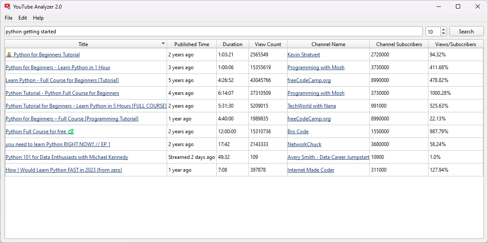

# YouTube Analyzer

Software for analyzing of YouTube search output.

Based on `youtubesearchpython` and `PySide6`.



## Features

- Show YouTube search result in the table with a lot of video parameters.
- Export search result to XLSX and CSV.
- YouTube API support (just set API key in the preferences).

## Usage

1. Install dependencies:
    ```cmd
    > pip install -r requirements.txt
    ```
2. Run application:
    ```cmd
    > python youtube-analyzer.py
    ```
3. Type a search request and click the "Search" button.
