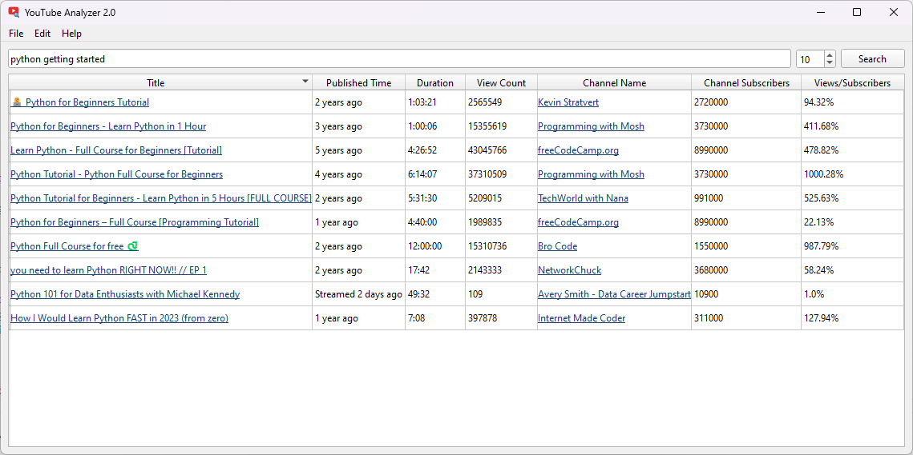
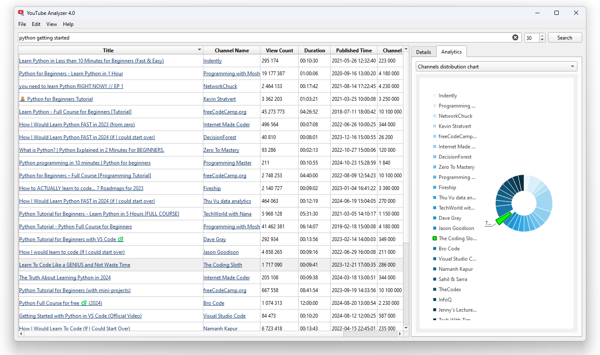

# YouTube Analyzer

**Advanced software for analyzing YouTube search results, trends, and autocomplete suggestions.**

Based on `PySide6` and `googleapiclient`.

## Features

### Search Analysis

- Display YouTube **search** and **trends** results in a detailed table with comprehensive video metrics.
- Display **preview gallery** and video **tags**.
- **Autocomplete insights**: analyze YouTube search suggestion lists.

### Analytics Tools

- Generate insightful **charts**:
    - **Channels distribution** (pie diagram)
    - **Video duration** (histogram)
    - **Popular title words** (pie diagram)

### Export Data

- **Save results** in multiple formats:
    - **XLSX** (Excel) for spreadsheet analysis.
    - **CSV** for lightweight data portability.
    - **HTML** for visual reports.

## Usage

1. Install dependencies:
    ```cmd
    > pip install -r requirements.txt
    ```
2. Launch the app:
    ```cmd
    > python -m youtubeanalyzer
    ```

## Screenshots






## Troubleshooting

YouTube Analyzer requires a YouTube API key to fetch search and trends results. Set your YouTube API key in the settings before using the app.
