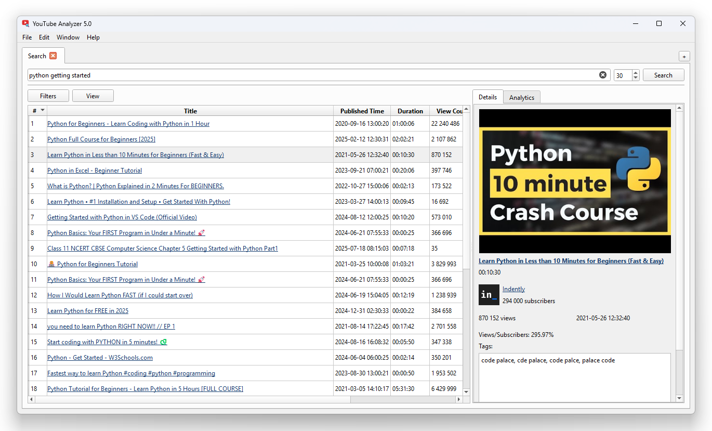

# YouTube Analyzer

**Advanced software for analyzing YouTube search results, trends, and autocomplete suggestions.**

Based on `PySide6`, `googleapiclient`, and `youtubesearchpython`.

## ✨ Features

### 🔍 Search Analysis

- Display YouTube **search** and **trends** results in a detailed table with comprehensive video metrics.
- Display **preview gallery** and video **tags**.
- **Autocomplete insights**: analyze YouTube search suggestion lists.
- **YouTube API support** (just set your API key in the settings).

### 📊 Analytics Tools

- Generate insightful **charts**:
    - **Channels distribution** (pie diagram)
    - **Video duration** (histogram)
    - **Popular title words** (pie diagram)

### 📤 Export Data

- **Save results** in multiple formats:
    - **XLSX** (Excel) for spreadsheet analysis.
    - **CSV** for lightweight data portability.
    - **HTML** for visual reports.

## 🚀 Usage

1. Install dependencies:
    ```cmd
    > pip install -r requirements.txt
    ```
2. Launch the app:
    ```cmd
    > python -m youtubeanalyzer
    ```

## 📸 Screenshots




## ⚠️ Troubleshooting

The default search engine for YouTube Analyzer is `youtubesearchpython`. But this component [is not supported anymore](https://github.com/alexmercerind/youtube-search-python/issues/189) by its maintainers and can have errors. Therefore, it is recommended to use YouTube Analyzer with YouTube API. Just set your YouTube API key in settings.
