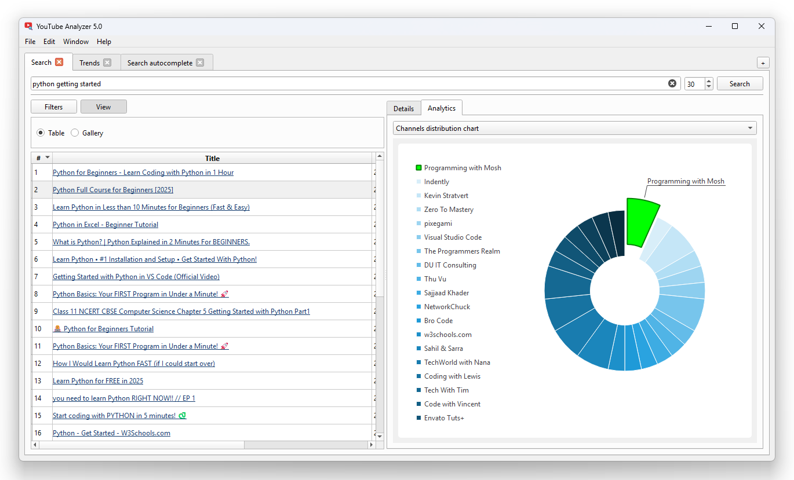

# YouTube Analyzer

Software for analyzing of YouTube search output.

Based on `PySide6`, `googleapiclient`, and `youtubesearchpython`.




## Features

- Show YouTube search result in the table with a lot of video parameters
- Show video preview and video tags
- Create analytical charts for search output:
    - Channels distribution pie diagram
    - Video duration histogram
    - Popular title words pie diagram
- Export search result to XLSX, CSV and HTML
- YouTube API support (just set your API key in the settings)

## Usage

1. Install dependencies:
    ```cmd
    > pip install -r requirements.txt
    ```
2. Run application:
    ```cmd
    > python youtube-analyzer.py
    ```
3. Type a search request and click the "Search" button.

## Troubleshooting

The default search engine for YouTube Analyzer is `youtubesearchpython`. But this component [is not supported anymore](https://github.com/alexmercerind/youtube-search-python/issues/189) by its maintainers and can have errors. Therefore, it is recommended to use YouTube Analyzer with YouTube API. Just set your YouTube API key in settings.
